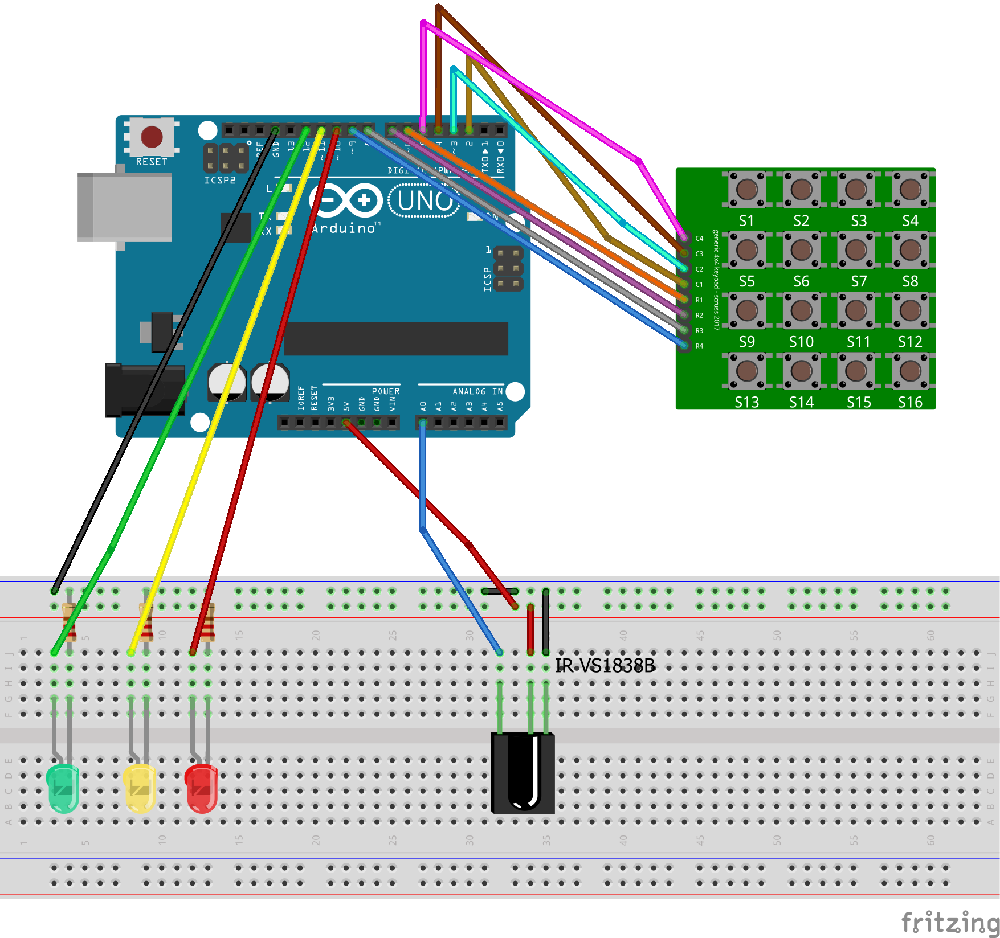

#Arduino-lock

**Arduino-lock** is a small project created for learning purposes. The idea is to create a *simulated lock* that is accessible through various inputs. Currently, available inputs are:
4x4 matrix keypad

The project is done on *Arduino UNO* clone.

##User interface
User can know the current state of lock via two outputs.
**LEDs** - three leds connected to [digital pins](#sketch)

| LED | lock state | 
| ------ | ------------ |
| green light | the lock is opened |
| red light | the lock is closed |
| yellow blink | a button was pressed |
| yellow & green light |  waiting for new access code |

**Serial monitor** - Arduino outputs lock state at the serial monitor. It is going to change to LCD display in the future.

##Libraries
Here’s a list of libraries used in this project. They are aviable at Arduino library manager.
| Library | Version | Link |
| --------- | ---------- | ------ |
| Keypad | 3.1.1 | [Link](https://playground.arduino.cc/Code/Keypad/) | 
| IRremote | 2.0.1 | [Link](https://github.com/shirriff/Arduino-IRremote.git) | 

##Sketch
Here’s the scetch of the project created in [Fritzing](https://fritzing.org/home/) software. You can [download it](sketch.fzz) and explore it by yourself.

##Components
Here’s a list of components used in this project.
| Component | Description |
| ---------------- | --------------- |
| Arduino UNO | An Arduino UNO clone. |
| 4x4 matrix | 4x4 matrix keypad used for user input. I used [this one](https://www.amazon.com/uxcell-Matrix-Keypad-Keyboard-Arduino/dp/B07QT85F75).  |
| LED | Standard green, yellow and red LEDs. |
| Resistors | Three 220K resistors |
| RC receiver | I used this really cheap 3 pin [RC receiver](https://www.aliexpress.com/item/32386238868.html). |

##Todolist
I want to continue this project for a little bit and work on:
code maintenance and readability
adding another inputs like RC and RFID
LCD display

